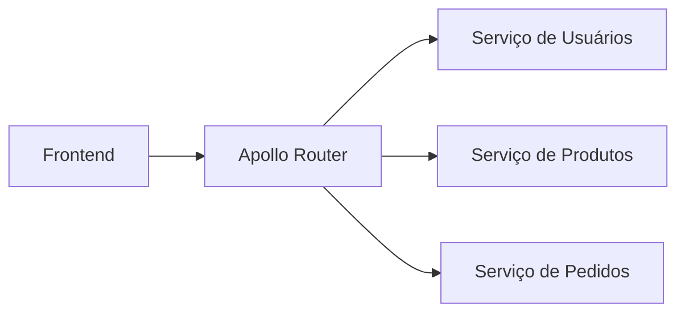

# Aplicação com GraphQL

**Apollo Server continua sendo uma das opções mais utilizadas e reconhecidas no ecossistema GraphQL**, especialmente em empresas que usam Apollo Federation/GraphOS. Em 2026, a versão atual é **Apollo Server 5**; a versão 4 chegou ao fim de vida em janeiro de 2026.  Apollo GraphQL+1

## Principais opções hoje

| Server | Ecossistema | Quando eu usaria |
| --- | --- | --- |
| **Apollo Server** | Apollo | ⭐ Empresas, APIs grandes, Federation |
| **GraphQL Yoga** | The Guild | APIs leves, flexibilidade, diferentes runtimes |
| **Mercurius** | Fastify | Projetos que já usam Fastify |

O **GraphQL Yoga** também é uma opção bastante relevante atualmente e tem como proposta ser cross-platform, com foco em performance e facilidade de configuração.  The Guild

Para o nosso projeto, **eu continuaria com Apollo Server**. Não há necessidade de trocar.

Inclusive, estamos usando exatamente a abordagem recomendada atualmente:

```ts
import { ApolloServer } from "@apollo/server";
import { startStandaloneServer } from "@apollo/server/standalone";
```

 A própria documentação atual do Apollo usa `@apollo/server` e `startStandaloneServer` nos exemplos de TypeScript.  Apollo GraphQL

## E por que escolher Apollo?

 Principalmente se você pretende evoluir para uma arquitetura maior:



Isso entra no conceito de **Apollo Federation**, onde vários serviços GraphQL podem formar um único grafo. O Apollo mantém ferramentas específicas para esse cenário.  Apollo GraphQL

Para aprender GraphQL, eu sugiro seguirmos com:

```
Node.js
   ↓
TypeScript
   ↓
Apollo Server 5
   ↓
GraphQL
   ↓
Prisma
   ↓
PostgreSQL
   ↓
Apollo Client / React
```

E aí podemos transformar o nosso exemplo atual em uma **API CRUD completa**, começando por `User`, usando **GraphQL Variables + Input Types + Prisma + PostgreSQL**. Esse caminho vai te ensinar praticamente a estrutura que você encontraria em um projeto profissional.

Uma aplicação GraphQL normalmente tem **3 partes principais**:

- **Schema**: define quais dados e operações a API oferece.
- **Resolvers**: implementam a lógica para buscar ou alterar os dados.
- **Servidor GraphQL**: recebe as queries/mutations e chama os resolvers.

Um exemplo simples usando **Node.js + TypeScript \+ Apollo Server**:

## 1\. Crie o projeto

```bash
mkdir minha-api
cd minha-api
npm init -y

npm install @apollo/server graphql
npm install -D typescript tsx @types/node
```

## 2\. Defina o schema

 Crie `src/schema.ts`:

```ts
export const typeDefs = `#graphql
  type User {
    id: ID!
    name: String!
    email: String!
  }

  type Query {
    users: [User!]!
    user(id: ID!): User
  }

  type Mutation {
    createUser(name: String!, email: String!): User!
  }
`;
```

 Aqui estamos dizendo que nossa API possui:

```
query {
  users
}
```

 e:

```
mutation {
  createUser(name: "Hora do QA", email: "horadoqa@email.com")
}
```

## 3\. Crie os resolvers

 `src/resolvers.ts`:

```ts
const users = [
  {
    id: "1",
    name: "João",
    email: "joao@email.com",
  },
];

export const resolvers = {
  Query: {
    users: () => users,

    user: (_: unknown, args: { id: string }) => {
      return users.find(user => user.id === args.id);
    },
  },

  Mutation: {
    createUser: (
      _: unknown,
      args: { name: string; email: string }
    ) => {
      const user = {
        id: String(users.length + 1),
        name: args.name,
        email: args.email,
      };

      users.push(user);

      return user;
    },
  },
};
```

 ### 4\. Crie o servidor

 `src/index.ts`:

```ts
import { ApolloServer } from "@apollo/server";
import { startStandaloneServer } from "@apollo/server/standalone";

import { typeDefs } from "./schema";
import { resolvers } from "./resolvers";

const server = new ApolloServer({
  typeDefs,
  resolvers,
});

async function startServer() {
  const { url } = await startStandaloneServer(server, {
    listen: {
      port: 4000,
    },
  });

  console.log(`🚀 Servidor rodando em ${url}`);
}

startServer();

```

 Adicione ao `package.json`:

```json
{
  "scripts": {
    "dev": "tsx watch src/index.ts"
  }
}
```

 E execute:

```
npm run dev
```

 Você terá uma API GraphQL em:

```
http://localhost:4000
```

 ### 5\. Faça uma query

 No GraphQL, o cliente especifica **exatamente os campos que quer receber**:

```
query {
  users {
    id
    name
    email
  }
}
```

 Resposta:

```json
{
  "data": {
    "users": [
      {
        "id": "1",
        "name": "Hora do QA",
        "email": "horadoqa@email.com"
      }
    ]
  }
}
```

 A grande diferença para uma API REST é que, em vez de ter endpoints como:

```
GET /users
GET /users/1
POST /users
```


