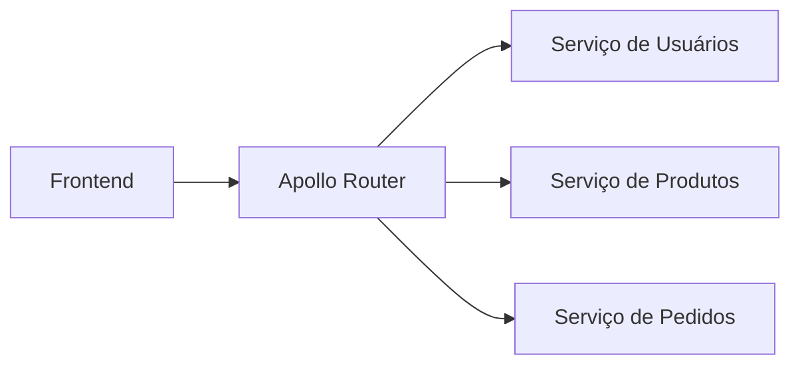

# Pré-requisitos

Para montar essa arquitetura com Apollo Router \+ GraphQL Federation**, eu recomendo esta base:

## 1\. Node.js

 Tenha uma versão LTS recente do Node.js instalada.

```
node --version
npm --version
```

## 2\. TypeScript

É altamente recomendado, principalmente para uma arquitetura com vários serviços.

Você precisa conhecer:

- Tipos e interfaces
- `async/await`
- Modules (`import` / `export`)
- Generics básicos
- `Promise`
- Configuração básica do `tsconfig.json`

## 3\. GraphQL

Antes de partir para Federation, é importante entender:

- Schema
- `Query`
- `Mutation`
- `Subscription`
- Resolver
- Types
- Arguments
- Variables
- Input Types
- Fragments
- Interfaces
- Enums

Por exemplo:

```
type Query {
  users: [User!]!
}

type User {
  id: ID!
  name: String!
  email: String!
}
```

## 4\. Apollo Server

 Você já começou por aqui. É importante entender:

```
Schema
   ↓
Resolver
   ↓
Apollo Server
   ↓
GraphQL API
```

 E saber trabalhar com:

```
const server = new ApolloServer({
  typeDefs,
  resolvers,
});
```

## 5\. HTTP / APIs

Você deve entender o básico de:

- HTTP
- GET / POST
- Headers
- Status codes
- JSON
- REST vs GraphQL
- Autenticação via headers

Por exemplo:

```
POST /graphql

Authorization: Bearer token
Content-Type: application/json
```

## 6\. Banco de dados

Para transformar nosso exemplo em uma aplicação real, recomendo:

```
PostgreSQL
    +
Prisma
```

Você precisa conhecer pelo menos:

- Tabelas
- Primary Key
- Foreign Key
- Relacionamentos
- `SELECT`
- `INSERT`
- `UPDATE`
- `DELETE`

## 7\. Docker

Não é obrigatório para começar, mas eu **recomendo muito**.

Principalmente para subir o PostgreSQL:

```
Docker
 └── PostgreSQL
```

## 8\. Federation

 Depois de dominar GraphQL básico, entramos no conceito mais importante da arquitetura que você mostrou:



 Aqui você precisa entender:

- Subgraph
- Apollo Router
- Federation
- Entities
- `@key`
- `@external`
- `@requires`
- `@provides`
- Schema composition

 Por exemplo:

```
type User @key(fields: "id") {
  id: ID!
  name: String!
}
```

## Ordem que eu recomendo

Como você já está com **Apollo Server funcionando**, eu seguiria nesta ordem:

```
1. GraphQL básico
       ↓
2. Apollo Server
       ↓
3. Queries
       ↓
4. Mutations
       ↓
5. Variables
       ↓
6. Input Types
       ↓
7. PostgreSQL
       ↓
8. Prisma
       ↓
9. Autenticação
       ↓
10. Apollo Federation
       ↓
11. Apollo Router
       ↓
12. Microsserviços
```

 **Não começaria pelo Federation agora.** Primeiro faria nosso `User API` funcionar completamente com **Apollo Server + TypeScript \+ Prisma + PostgreSQL**. 
 
 
 Depois transformamos essa API em um **User Subgraph** e adicionamos Products e Orders.

 Essa evolução vai fazer você entender _por que_ o Apollo Router existe, em vez de apenas copiar uma configuração.